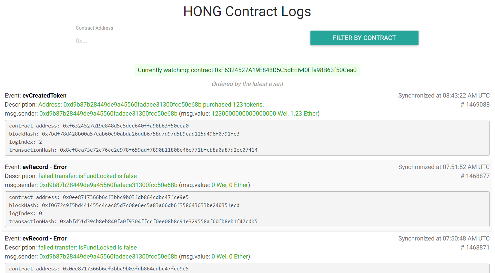

NodeJS Backend for HONG Contract Event listener
================

## Live Version

The source code is running here: http://107.178.211.223:5000/logs

## Software requirement

### NodeJS
- Check package.json for details: execute `npm install`

### Geth
- This program requires existence of `geth`.
- To start geth, execute `sudo geth --rpc console`

### MySQL
- You will need a MySQL instance running to save log data. Copy the file `config.json.tmpl` as `config.json`, and fill in access info to your MySQL server.
- Check `schema.sql` for database schema.

## Run the server

1. Deploy a contract with Mist Testnet.

2. Start server with `nodejs listener.js`. The server will be up at http://localhost:5000. Then paste your contract source code in the form. After compiling, paste the contract address and pick the contract name deployed in the form.

3. Submit the form. Contract events will be watched.

4. View logs from http://localhost:5000/logs.

Note: The script can watch one contract at one time. Only the last contract will be watched after re-configuration.
